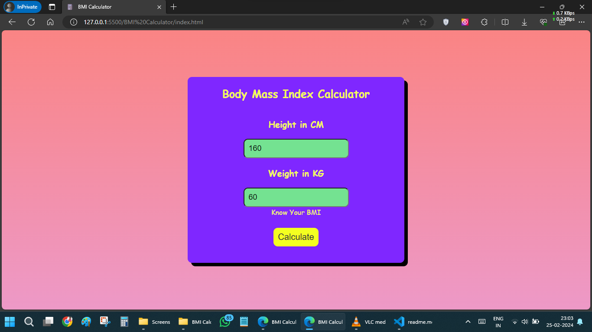
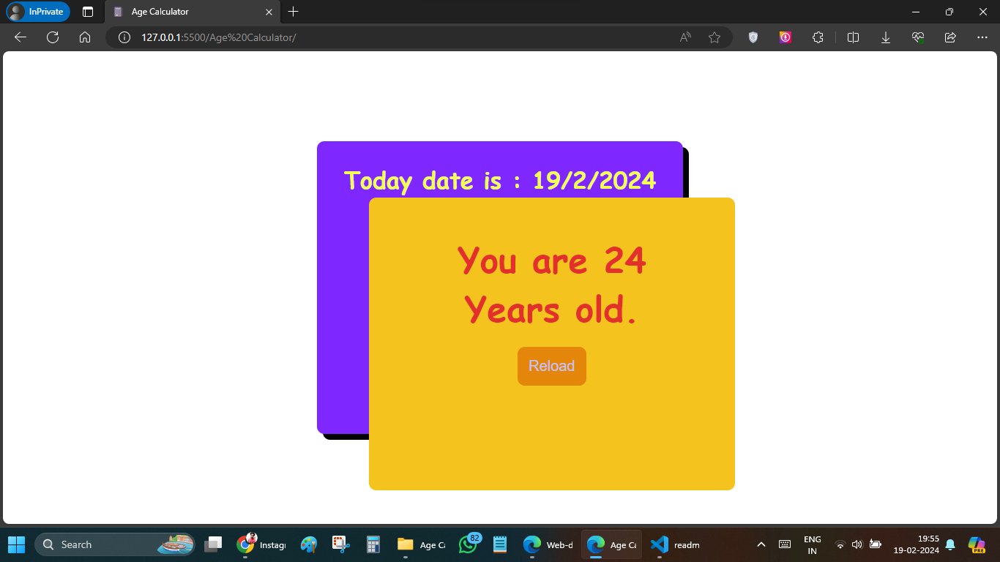

# Welcome 🖐 to the BMI Calculator
It is a simple Javascript project which calculates our Body Mass Index.

<<<<<<< HEAD
## Demo view

=======
## Default view

>>>>>>> 8bc4d59dd01d2492e0beb04eb9fc03f2724114c5

## 💻Tech Stack
<br>


<br>

### How to use:

---

- Download or clone the repository

```
git clone https://github.com/shouvikmistry/Mini-Projects-Web-Dev.git
```

- Go to the directory
- Run the index.html file
- Enter your DOB and find age..

<br>

## Happy Coding!
