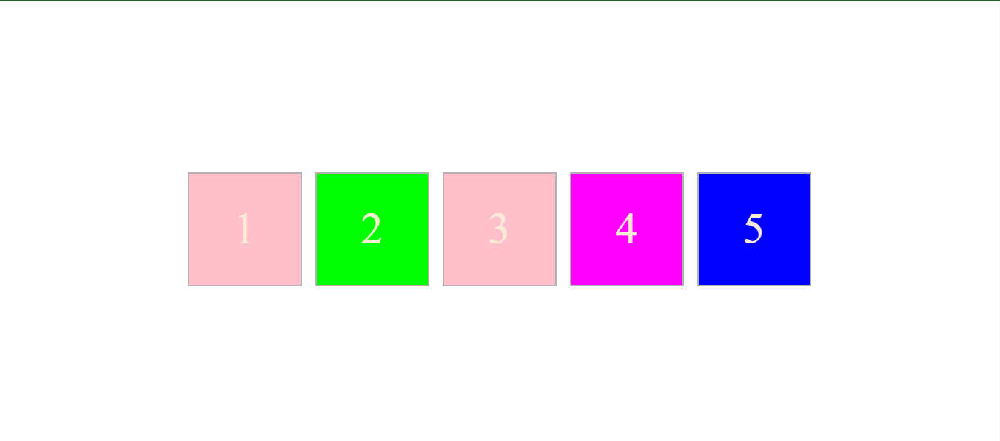
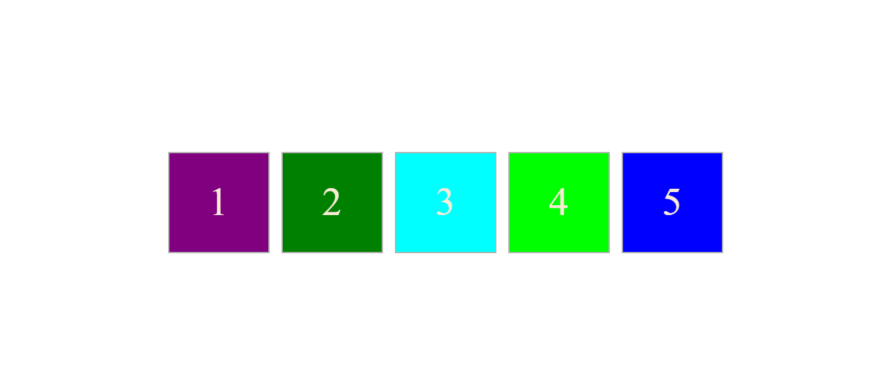

# Welcome 🖐 to the Random Colour Boxes

A simple JavaScript project that randomly generates colors for boxes using JavaScript.

---

## Default View

Here are some screenshots of the project:

  


---

## 💻 Tech Stack

This project uses the following technologies:

  
  


---

## 🚀 How to Use

Follow these steps to run the project:

1. Download or clone the repository:

    ```bash
    git clone https://github.com/shouvikmistry/Mini-Projects-Web-Dev.git
    ```

2. Navigate to the project directory.
3. Open the `index.html` file in your browser.
4. Click on the boxes to see them change to random colors.

---

## 🎉 Happy Coding!